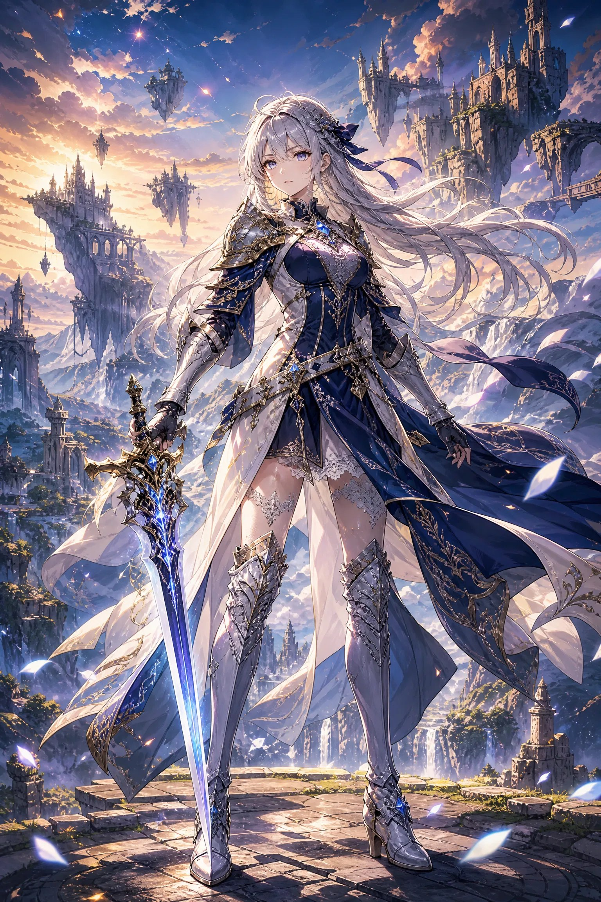
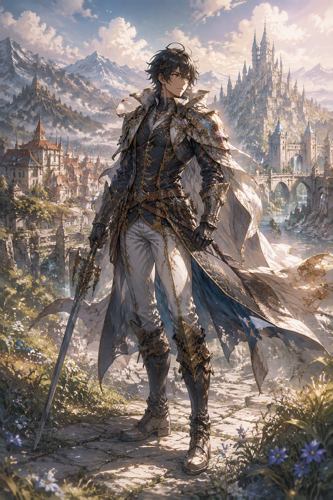
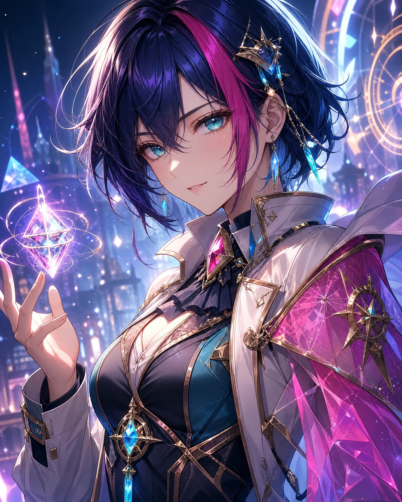
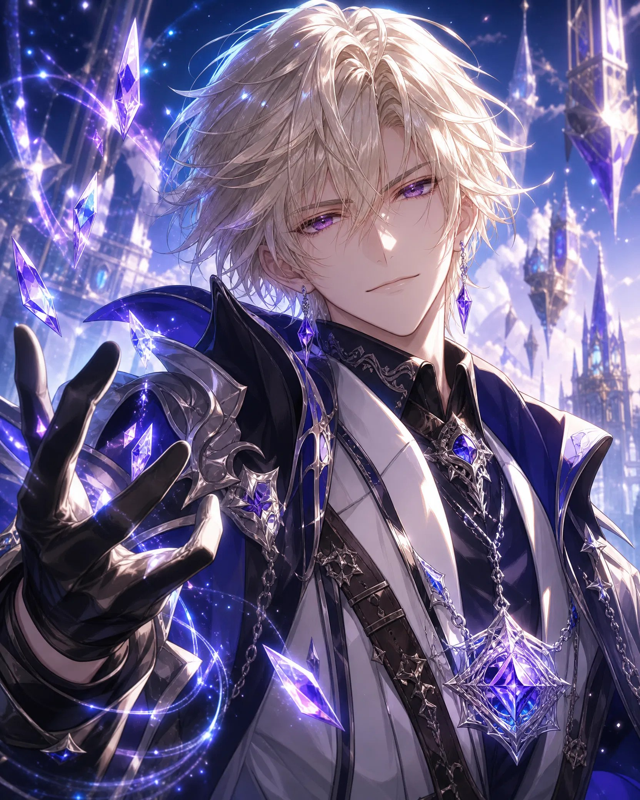
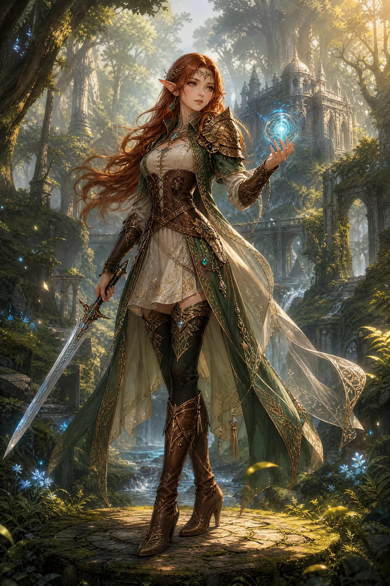
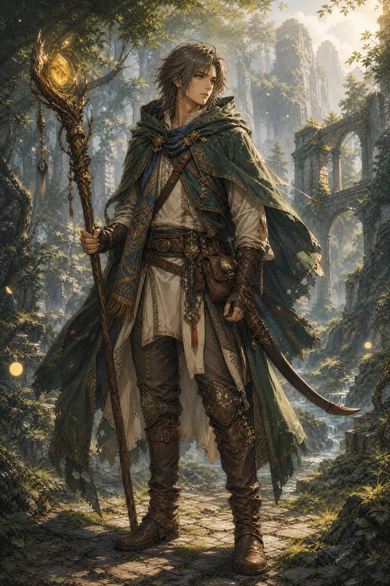
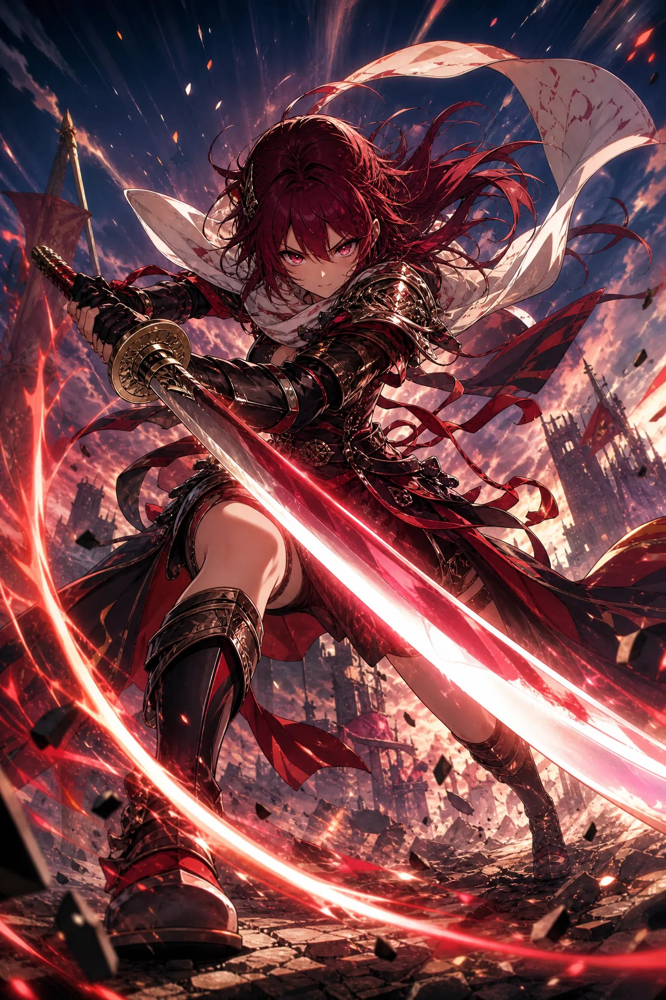
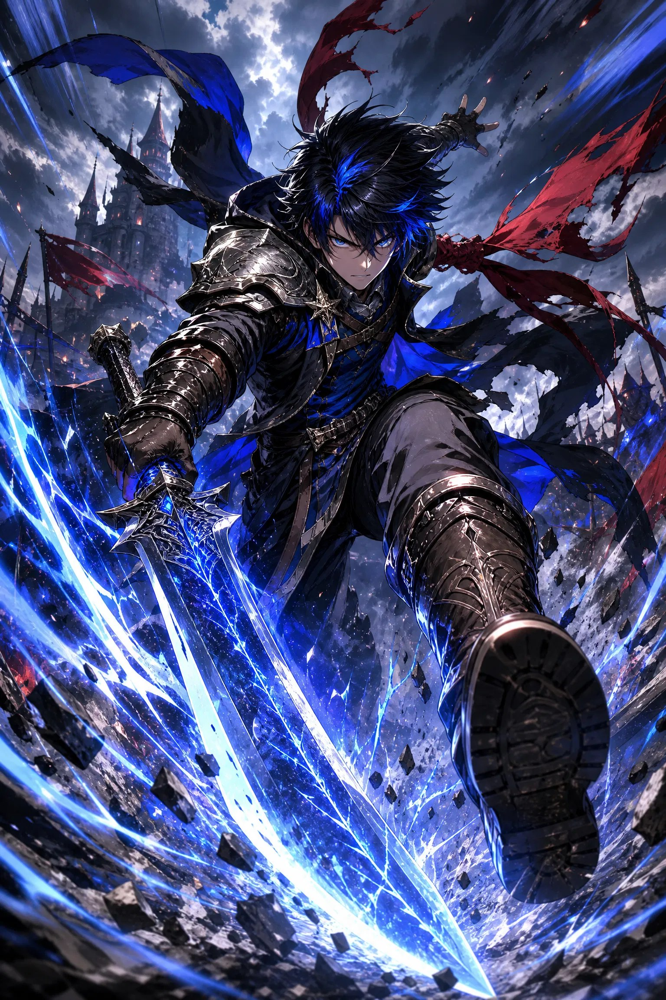

# 游戏角色四件套 · 实测画廊

> 来源：作者原创《动漫Prompt系列03》。以下示例图均由文中提示词直接生成，提示词与图片按 MIT 授权发布。
>
> - 模板源文件（可变量化）：`prompts/05-game-character/`
> - 完整三平台适配案例（YAML）：`examples/` 下 `*-combo.yaml`

| 组合 | 一句话用途 | 建议比例 |
|---|---|---|
| ① JRPG 角色卡 | 甲方要"游戏原画感"时首选 | 2:3 |
| ② 手游/抽卡立绘 | 仿米哈游/鹰角调性，手游外包最常被要求 | 9:16 |
| ③ RPG 全身立绘 | 角色设定集、TRPG 跑团用图 | 9:16 |
| ④ 战斗立绘（动态） | 技能特效展示图、卡牌战斗画面 | 16:9 |

## 使用方法（10 秒上手）

1. 选好组合 → 点代码块右上角按钮**一键复制**
2. **GPT-Image-2**：整段粘贴即可（规避项已内置在末尾）
3. **Midjourney**：确认结尾是 `--niji 6`（动漫题材别用 `--v`）
4. **SDXL**：positive / negative 分开填入
5. 想换成自己的角色：**在提示词最前面加一句主体描述**，如 `a silver-haired swordswoman,`

---

## ① JRPG 角色卡

适合：日式RPG角色设定，甲方要"游戏原画感"时首选。

<p>
  
  &nbsp;
  
</p>

**GPT-Image-2**

```text
Japanese anime, JRPG character art, fantasy game aesthetic,
painterly anime, rich brush strokes,
dramatic lighting, rim lighting,
full body shot,
fantasy background, ornate costume,
epic mood, heroic atmosphere.
Do not include: cropped limbs, flat lighting, modern clothing, text, watermark.
```

**Midjourney Niji**

```text
Japanese anime, JRPG character art, fantasy game aesthetic, painterly anime,
rich brush strokes, dramatic lighting, rim lighting, full body shot,
fantasy background, ornate costume, epic mood, heroic atmosphere
--niji 6 --ar 2:3 --no cropped limbs, flat lighting, modern clothing, text, watermark
```

**SDXL**

```text
Positive:
Japanese anime, JRPG character art, fantasy game aesthetic, painterly anime,
rich brush strokes, dramatic lighting, rim lighting, full body shot,
fantasy background, ornate costume, epic mood, heroic atmosphere,
masterpiece, best quality

Negative:
cropped limbs, flat lighting, modern clothing, text, watermark,
extra fingers, malformed hands, low resolution
Steps: 30 | CFG: 6.0 | Sampler: DPM++ 2M Karras
```

完整案例：[`examples/jrpg-card-combo.yaml`](../examples/jrpg-card-combo.yaml)

---

## ② 二次元手游 / 抽卡立绘

仿米哈游/鹰角风格，这套是接手游外包最常被要求的调性。

<p>
  
  &nbsp;
  
</p>

**GPT-Image-2**

```text
modern anime, anime mobile game character, gacha game artwork,
semi-realistic anime, polished character design,
cinematic lighting, soft rim light,
medium close-up,
detailed costume, sparkling effects,
vibrant colors, high saturation.
Do not include: busy background overpowering the character, rough sketch texture,
muted colors, text, watermark.
```

**Midjourney Niji**

```text
modern anime, anime mobile game character, gacha game artwork, semi-realistic anime,
polished character design, cinematic lighting, soft rim light, medium close-up,
detailed costume, sparkling effects, vibrant colors, high saturation
--niji 6 --ar 9:16 --no busy background, rough sketch texture, muted colors, text, watermark
```

**SDXL**

```text
Positive:
modern anime, anime mobile game character, gacha game artwork, semi-realistic anime,
polished character design, cinematic lighting, soft rim light, medium close-up,
detailed costume, sparkling effects, vibrant colors, high saturation,
masterpiece, best quality

Negative:
busy background overpowering the character, rough sketch texture, muted colors,
text, watermark, extra fingers, malformed hands, low resolution
Steps: 30 | CFG: 6.0 | Sampler: DPM++ 2M Karras
```

> 💡 **四件套里最容易被甲方打回的就是②** —— 手游立绘的"精致感"很难量化，问题往往出在
> `semi-realistic anime` 这个词的强度没控制好：**加多了显得像插画不像手游，加少了显得糊**。
> 从上面代码块的原剂量起步，再按需微调。

完整案例：[`examples/gacha-standing-combo.yaml`](../examples/gacha-standing-combo.yaml)

---

## ③ RPG 全身立绘

适合：角色设定集、TRPG 跑团用图。

<p>
  
  &nbsp;
  
</p>

**GPT-Image-2**

```text
fantasy RPG character illustration, anime game art,
detailed rendering, textured painting,
natural lighting, volumetric light,
full body shot, three-quarter view,
fantasy background, detailed costume,
character concept art, immersive atmosphere.
Do not include: busy composition hiding the silhouette, close-up crop,
text, watermark.
```

**Midjourney Niji**

```text
fantasy RPG character illustration, anime game art, detailed rendering,
textured painting, natural lighting, volumetric light, full body shot,
three-quarter view, fantasy background, detailed costume,
character concept art, immersive atmosphere
--niji 6 --ar 9:16 --no busy composition, close-up crop, text, watermark
```

**SDXL**

```text
Positive:
fantasy RPG character illustration, anime game art, detailed rendering,
textured painting, natural lighting, volumetric light, full body shot,
three-quarter view, fantasy background, detailed costume,
character concept art, immersive atmosphere, masterpiece, best quality

Negative:
busy composition hiding the silhouette, close-up crop, text, watermark,
extra fingers, malformed hands, low resolution
Steps: 30 | CFG: 6.0 | Sampler: DPM++ 2M Karras
```

完整案例：[`examples/rpg-fullbody-combo.yaml`](../examples/rpg-fullbody-combo.yaml)

---

## ④ 战斗立绘（动态）

适合：技能特效展示图、卡牌游戏战斗画面。

<p>
  
  &nbsp;
  
</p>

**GPT-Image-2**

```text
anime battle character, JRPG character art,
semi-realistic anime, dynamic rendering,
dramatic lighting, speed lines,
dynamic action shot, low angle shot,
flowing clothing, action effects,
high-energy atmosphere, intense expression.
Do not include: static standing pose, calm empty background, pastel softness,
text, watermark.
```

**Midjourney Niji**

```text
anime battle character, JRPG character art, semi-realistic anime, dynamic rendering,
dramatic lighting, speed lines, dynamic action shot, low angle shot,
flowing clothing, action effects, high-energy atmosphere, intense expression
--niji 6 --ar 16:9 --no static pose, calm empty background, pastel softness, text, watermark
```

**SDXL**

```text
Positive:
anime battle character, JRPG character art, semi-realistic anime, dynamic rendering,
dramatic lighting, speed lines, dynamic action shot, low angle shot,
flowing clothing, action effects, high-energy atmosphere, intense expression,
masterpiece, best quality

Negative:
static standing pose, calm empty background, pastel softness, text, watermark,
extra fingers, malformed hands, low resolution
Steps: 30 | CFG: 6.0 | Sampler: DPM++ 2M Karras
```

完整案例：[`examples/battle-dynamic-combo.yaml`](../examples/battle-dynamic-combo.yaml)

---

## 下一步

米哈游 / 鹰角 / 网易等具体厂商调性的细分参数拆解，规划中（见 [open-source-roadmap.md](open-source-roadmap.md)）。
